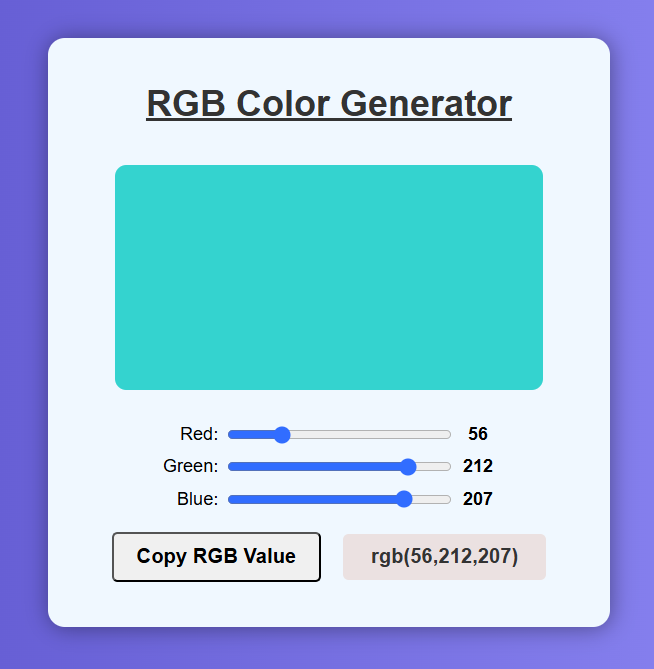

# 🎨 RGB Color Generator

A clean and interactive RGB Color Generator that lets users customize red, green, and blue values using sliders and preview the color live.

## 📸 Screenshot



## 🚀 Features

- Live preview of selected RGB color
- Sliders to control Red, Green, and Blue values (0–255)
- Displays exact RGB value in text
- Copy RGB color value to clipboard with a single click
- Stylish and responsive design

## 🔧 Technologies Used

- HTML5
- CSS3 (Flexbox, Gradients, UI styling)
- JavaScript (DOM Manipulation, Clipboard API)

## 📂 How to Use

1. Clone this repository:

   ```bash
   git clone https://github.com/KTsaneff/rgb-color-generator.git
   cd rgb-color-generator
